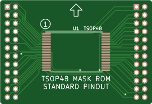
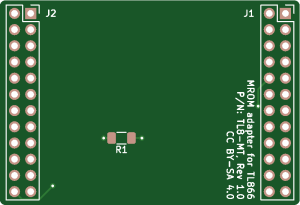
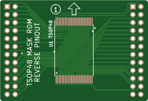
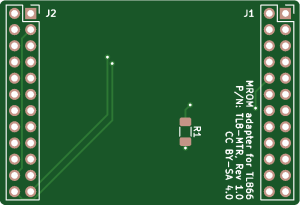
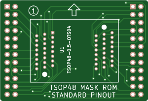
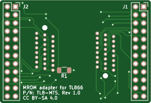
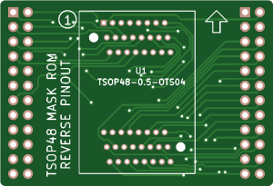
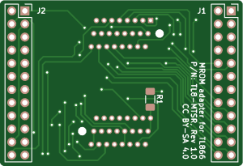

This is a series of adapter boards designed to allow reading 16-bit TSOP48 mask ROMs using a TL866-series programmer. These ROMs have a pinout which is not compatible with the standard pinout used by TSOP48 EPROM/flash chips, and can be identified by pin 1 (/BYTE) being tied to either Vcc or ground. Sometimes these ROMs are manufactured with reverse pinouts (pins 1-24 on the right); this set of adapters is designed for both normal and reverse pinouts.

The adapters fit onto the same SN001 expansion board used for the regular SOP/TSOP adapters, and allow reading the chips as the corresponding 29-series flash chips (e.g. 29F800). ROM sizes from 8 to 64 Mbit are supported.

The following configurations are available:
* TL8-MT: normal pinout
* TL8-MTR: reverse pinout
* TL8-MTS: normal pinout, ZIF socket
* TL8-MTSR: reverse pinout, ZIF socket

Solder pads on the socket-less adapters are elongated to support both 16.4mm and 18.4mm chips.

Zipped gerbers are available from the releases section.

# Notes

* When reading, disable "Check ID" as this option is not supported by mask ROMs.
* If Pin Detect is enabled, the programmer will report errors on pins 11, 12, and 15, which are flash programming pins that don't exist on mask ROMs. If no other pins report errors, you can safely disable pin detection.
    * Pin 47 (/BYTE) may also display an error on mask ROMs that don't support byte mode - check your ROM's datasheet. The programmer should still use word mode when reading.
* The resistor R1 is a pulldown on A21, which is a ground pin on ROMs smaller than 64 Mbit. If you only plan on reading smaller ROMs, you can also use a 0-ohm or small wire jumper here.

# Parts

| Ref | Part |
| --- | --- |
| J1, J2 | 2x12 female pin header, 2.54mm pitch |
| R1 | 1206, 3.3k
| U1 | ANDK TSOP48-0.5-OTS04 (socketed boards only) |

# Board images

 

 

 

 

# License

These PCBs are released under the Creative Commons Attribution-ShareAlike 4.0 (CC BY-SA) license.
